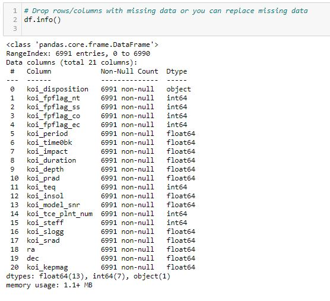

# Machine-Learning
Machine Learning- Exoplanet Exploration

## Table of contents
* [Exoplanet Exploration](#exoplanet-exploration)
* [Technologies](#technologies)
* [EDA](#eda)
* [Models](#models)
* [Accuracy](#accuracy)
* [Resources](#resources)
* [Contact](#contact)

## Exoplanet Exploration

Over a period of nine years in deep space, the NASA Kepler space telescope has been on a planet-hunting mission to discover hidden planets outside of our solar system. To help process this data, I have created a machine learning model capable of classifying candidate exoplanets from the raw dataset.

## Technologies
* Machine Learning 
* Jupyter Notebook / Pandas
* SkLearn

## EDA

Exploratory Data Analysis & data cleaning

I imported the [exponent data](https://github.com/RutgersCodingBootcamp/RUT-SOM-DATA-PT-09-2020-U-C/blob/master/02-Homework/21-Machine-Learning/Instructions/starter_code/exoplanet_data.csv) into a jupyter notebook to clean and test the data. After importing the data, I needed to refer to the [Data Dictionary](https://exoplanetarchive.ipac.caltech.edu/docs/API_kepcandidate_columns.html) from NASA to understand the column meanings and what data I needed for my machine learning models.

I printed the column names to find that ½ of the column data was “margin of error” denoted by “err” in the name. I removed these columns by using the function `.drop(columns )` . 

Then I used ` df.info() ` to view the data type. From this view, I could see that all data was in integer/float form except for ‘koi_disposition’ which was an object. I dropped it for my X value: `X = df.drop(columns=["koi_disposition"])`

I then used a `RandomForestClassifier` to see the importance of the balance of the columns to see what was needed for the models. 

I decided to keep columns with an importance value of higher than 0.04. This left 9 columns of important data to fit in my model. 

I performed a test/split on my data. 

Then I scaled the data using a `StandardScaler()` 

## Models

## Accuracy 

## Resources

[Exponent Data](https://github.com/RutgersCodingBootcamp/RUT-SOM-DATA-PT-09-2020-U-C/blob/master/02-Homework/21-Machine-Learning/Instructions/starter_code/exoplanet_data.csv)

[NASA Data Dictionary](https://exoplanetarchive.ipac.caltech.edu/docs/API_kepcandidate_columns.html)

## Contact

[Sara Simoes](https://github.com/Ssimoes48)
